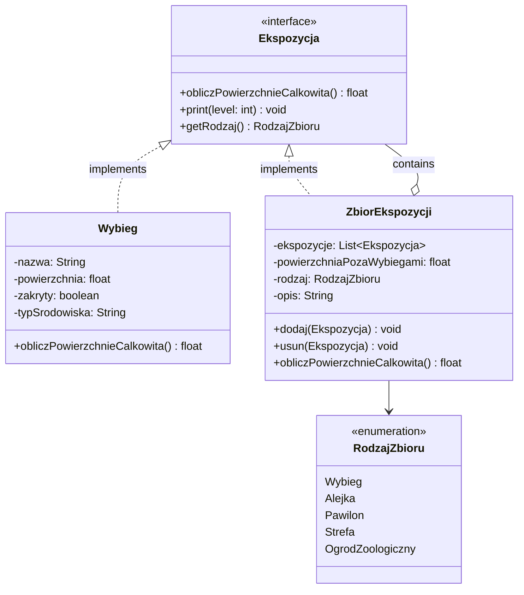
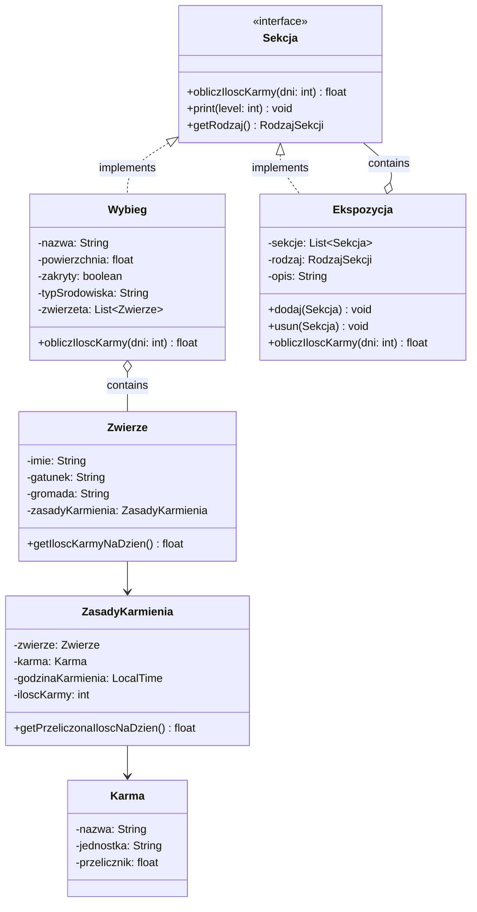
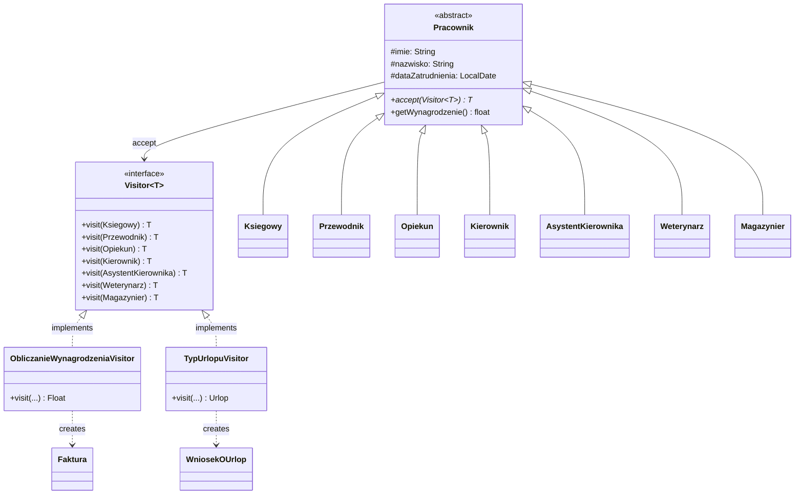

# Zoo Management System - Design Patterns in Java

University software engineering projects demonstrating **Composite** and **Visitor** design patterns, applied to a zoo management domain. Each project builds on the previous one, progressing from a basic hierarchical structure to advanced behavioral patterns.

> [!IMPORTANT]
> Class and method names in the source code are in Polish, as required by the course. English translations are provided in parentheses throughout this README.

## Projects Overview

| Project | Pattern | Focus |
|---------|---------|-------|
| [`zoo-composite-pattern-simple`](#project-1-composite-pattern--basic) | Composite | Hierarchical zoo structure with recursive area calculation |
| [`zoo-composite-pattern`](#project-2-composite-pattern--extended) | Composite | Extends the above with animals, feed types, and food quantity calculations |
| [`zoo-visitor-pattern`](#project-3-visitor-pattern) | Visitor | Zoo employees with role-based salary and leave calculations |

---

## Project 1: Composite Pattern - Basic

Models a zoo as a tree of exhibitions: Zoo → Zones → Pavilions → Alleys → Enclosures. Each node can calculate its total area recursively through the hierarchy.

**Key classes:**
- Exhibition (`Ekspozycja`) - component interface with area calculation
- Enclosure (`Wybieg`) - leaf node representing a single animal enclosure
- Exhibition Collection (`ZbiorEkspozycji`) - composite node that aggregates child exhibitions
- Collection Type (`RodzajZbioru`) - enum defining hierarchy levels (Enclosure, Alley, Pavilion, Zone, Zoo)

---

## Project 2: Composite Pattern - Extended

Builds on the basic version by introducing animals, feed types, and feeding rules. The recursive operation now calculates total food quantity needed across the entire zoo for a given number of days.

**Changes from the basic version:**
- Component interface renamed from `Ekspozycja` to Section (`Sekcja`)
- Composite class renamed from `ZbiorEkspozycji` to Exhibition (`Ekspozycja`)
- Added Animal (`Zwierze`), Feed (`Karma`), and Feeding Rules (`ZasadyKarmienia`) domain classes

---

## Project 3: Visitor Pattern

Models zoo employees with different roles. Uses the Visitor pattern to calculate salaries and determine leave types without modifying employee classes - new operations can be added by implementing a new visitor.

### Salary Rules

Base salary: 4500. Each role has specific modifiers:

| Role | Salary Formula |
|------|---------------|
| Accountant (`Ksiegowy`) | 1.1x base + 25 per invoice issued last month |
| Guide (`Przewodnik`) | base + 300 if speaks Polish |
| Caretaker (`Opiekun`) | 1.2x base - 750 if student |
| Manager (`Kierownik`) | 2.0x base |
| Assistant Manager (`AsystentKierownika`) | 1.5x base |
| Veterinarian (`Weterynarz`) | 1.3x base + 150/year outside zoo + degree bonus + 150/specialization |
| Warehouse Worker (`Magazynier`) | base + 150/year employed |

### Leave Rules

Standard leave: 14 days. Each role has specific rules:

| Role | Leave Type | Max Days |
|------|-----------|----------|
| Accountant (`Ksiegowy`) | Pracowniczy | 14 + years/2 |
| Guide (`Przewodnik`) | Pracowniczy | 14 + years/2 |
| Caretaker (`Opiekun`) | Opiekuna | 14 + 14 if student |
| Manager (`Kierownik`) | - | Unlimited (no request needed) |
| Assistant Manager (`AsystentKierownika`) | Asystencki | 14 + years/2 + 5 |
| Veterinarian (`Weterynarz`) | Weterynarza | 14 + ext. experience + degree bonus |
| Warehouse Worker (`Magazynier`) | Nieuprzywilejowany | 14 |

---

## Tech Stack

- Java
- IntelliJ IDEA

## How to Run

1. Open any project folder in IntelliJ IDEA.
2. Run `Main.java` - each project has its own main class demonstrating the pattern in action.
